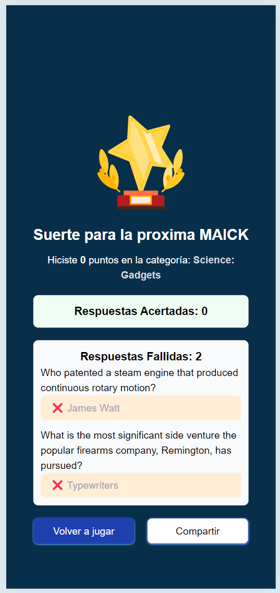

# Trivia Challenge

## Descripción

Este es un proyecto de trivia que te permite jugar y poner a prueba tus conocimientos en diferentes categorías. Puedes
competir solo o con amigos para ver quién obtiene la puntuación más alta.



## LIVE DEMO
https://trivia-challenge-app.netlify.app/

## Instalación

Sigue estos pasos para configurar y ejecutar el proyecto localmente:

1. Clona este repositorio en tu máquina local usando `git clone`.
2. Navega al directorio del proyecto: `cd trivia-challenge`.
3. Instala las dependencias del proyecto con el comando: `npm install`.

## Uso

Una vez que hayas instalado las dependencias, puedes iniciar el servidor de desarrollo con el siguiente comando:

```bash
npm run dev
```

Esto abrirá la aplicación en tu navegador predeterminado. Si no se abre automáticamente, puedes acceder a ella
en [http://localhost:3000](http://localhost:3000).

## Características

- **Inicio de sesión**: Inicia sesión con tu nombre y elige una categoría para comenzar a jugar.
- **Puntuación**: Obtén puntos por cada respuesta correcta y compite por la puntuación más alta.
- **Categorías**: Elige entre diferentes categorías de preguntas para poner a prueba tus conocimientos.
- **Preguntas aleatorias**: Las preguntas se seleccionan al azar para que cada juego sea diferente.
- **Pistas**: Utiliza pistas para obtener ayuda con las preguntas más difíciles.
- **Finalización del juego**: El juego termina cuando respondes todas las preguntas o te quedas sin tiempo.
- **Puntuación final**: Al final del juego, se muestra tu puntuación final y puedes ver las respuestas correctas e
  incorrectas.
- **Reinicio del juego**: Puedes reiniciar el juego en cualquier momento para jugar de nuevo.
- **Puntuaciones**: Guarda tu puntuación más alta en el almacenamiento local para compararla con tus juegos anteriores.
- **Diseño responsivo**: La aplicación es compatible con dispositivos móviles y de escritorio.